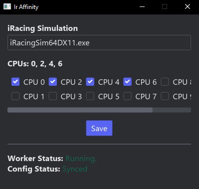

# Ir Affinity

For setting the CPU affinity of a process.

Mainly for iRacing where the simulator process is created sometime after
interacting with their Desktop application.

## Example

## Development 

Add `DATABASE_URL=sqlite:./sqlx.sqlite` to `.env` file.

`sqlx` commands:
- `sqlx database create`
- `sqlx migrate run`
- `cargo sqlx prepare`
